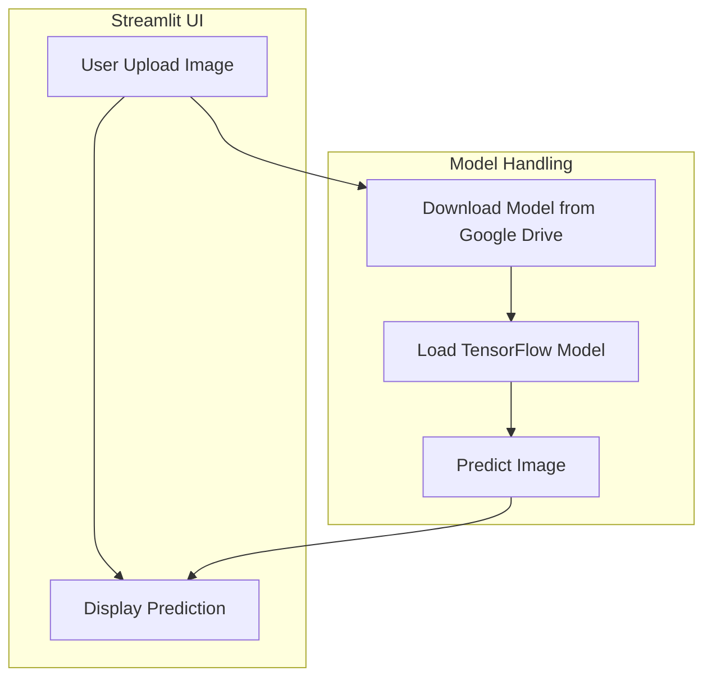

# Project Blueprint for AI-Animal-Classifier

## Overview

The **AI-Animal-Classifier** project provides a Streamlit‑based web interface for classifying animal images using a deep learning model. The model is stored externally (Google Drive) due to its large size and is loaded at runtime.

## Technology Stack

- **Language**: Python 3.x
- **Web Framework**: Streamlit (v1.44.1)
- **Machine Learning**: TensorFlow 2.19.0, Keras 3.9.2, NumPy 2.1.3, Pandas 2.2.3, PyArrow 19.0.1, etc.
- **Data Handling & Utilities**: pandas, numpy, tqdm, rich, python‑dateutil, pytz, requests, beautifulsoup4, Jinja2, etc.
- **Visualization**: Altair, markdown‑it‑py, Mermaid (for diagrams in docs)
- **Deployment**: Can be run locally via `streamlit run main.py` or packaged with Docker for container deployment.
- **Version Control**: Git (GitPython used for repo interactions)
- **Testing & Logging**: TensorBoard, tqdm, rich, watchdog.

## Library List (from `requirements.txt`)

| Library | Version |
|---|---|
| absl-py | 2.2.2 |
| altair | 5.5.0 |
| astunparse | 1.6.3 |
| attrs | 25.3.0 |
| beautifulsoup4 | 4.13.3 |
| blinker | 1.9.0 |
| cachetools | 5.5.2 |
| certifi | 2025.1.31 |
| charset-normalizer | 3.4.1 |
| click | 8.1.8 |
| colorama | 0.4.6 |
| filelock | 3.18.0 |
| flatbuffers | 25.2.10 |
| gast | 0.6.0 |
| gdown | 5.2.0 |
| gitdb | 4.0.12 |
| GitPython | 3.1.44 |
| google-pasta | 0.2.0 |
| grpcio | 1.71.0 |
| h5py | 3.13.0 |
| idna | 3.10 |
| Jinja2 | 3.1.6 |
| jsonschema | 4.23.0 |
| jsonschema-specifications | 2024.10.1 |
| keras | 3.9.2 |
| libclang | 18.1.1 |
| Markdown | 3.7 |
| markdown-it-py | 3.0.0 |
| MarkupSafe | 3.0.2 |
| mdurl | 0.1.2 |
| ml_dtypes | 0.5.1 |
| namex | 0.0.8 |
| narwhals | 1.33.0 |
| numpy | 2.1.3 |
| opt_einsum | 3.4.0 |
| optree | 0.14.1 |
| packaging | 24.2 |
| pandas | 2.2.3 |
| pillow | 11.1.0 |
| protobuf | 5.29.4 |
| pyarrow | 19.0.1 |
| pydeck | 0.9.1 |
| Pygments | 2.19.1 |
| PySocks | 1.7.1 |
| python-dateutil | 2.9.0.post0 |
| pytz | 2025.2 |
| referencing | 0.36.2 |
| requests | 2.32.3 |
| rich | 14.0.0 |
| rpds-py | 0.24.0 |
| six | 1.17.0 |
| smmap | 5.0.2 |
| soupsieve | 2.6 |
| streamlit | 1.44.1 |
| tenacity | 9.1.2 |
| tensorboard | 2.19.0 |
| tensorboard-data-server | 0.7.2 |
| tensorflow | 2.19.0 |
| tensorflow-io-gcs-filesystem | 0.31.0 |
| termcolor | 3.0.1 |
| toml | 0.10.2 |
| tornado | 6.4.2 |
| tqdm | 4.67.1 |
| typing_extensions | 4.13.1 |
| tzdata | 2025.2 |
| urllib3 | 2.3.0 |
| watchdog | 6.0.0 |
| Werkzeug | 3.1.3 |
| wrapt | 1.17.2 |

## Architecture Diagram

## Data Flow

1. User uploads an image via the Streamlit interface.
2. If the model file is not present locally, the app downloads it from the provided Google Drive link.
3. The TensorFlow/Keras model is loaded into memory.
4. The image is pre‑processed and fed to the model for inference.
5. The predicted class label is displayed back to the user.

## Deployment Considerations

- **Local Development**: `streamlit run main.py`.
- **Production**: Containerize with Docker, mount a volume for the model file to avoid repeated downloads.
- **Model Size**: Model (~228 MB) is stored externally; ensure sufficient storage and network bandwidth.

## Testing & Verification

- Manual UI testing: upload various animal images and verify predictions.
- Unit tests (optional) for preprocessing functions.
- Verify that the model download logic correctly caches the file.

## Future Roadmap

- Add support for multiple model versions.
- Implement batch image classification.
- Provide an API endpoint for programmatic access.
- Enhance UI with confidence scores and visual explanations.

---

## 👨‍💻 Author

|Profile                                                                                                   | Member Name                   | Role                                              | GitHub                                                            | LinkedIn                                                          |
|----------------------------------------------------------------------------------------------------------|-------------------------------|---------------------------------------------------|-------------------------------------------------------------------|-------------------------------------------------------------------|
|       | Saidul Ali Mallick (Sami)     | Backend Developer & AIML Engineer & Team Lead     | [@saidulalimallick04](https://github.com/saidulalimallick04)      | [@saidulalimallick04](https://linkedin.com/in/saidulalimallick04) |

> ❤️ I believe in building impact, not just writing code.
> _💚 Backend Sage signing off.._
