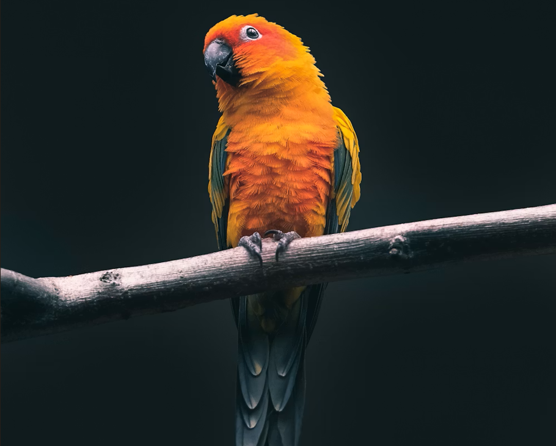

# 🦁 AI Animal Classifier

> **A State-of-the-Art Deep Learning Application for Animal Identification**



## 📖 Overview

The **AI Animal Classifier** is a robust computer vision application capable of identifying **99 different animal species** from images. Built with **TensorFlow/Keras** and wrapped in a modern **Streamlit** interface, it offers real-time predictions, persistent history tracking, and a dynamic dashboard for analyzing model performance.

Whether you're a wildlife enthusiast, a student, or a developer, this tool turns your device into an intelligent animal scanner.

---

## ✨ Key Features

- **📸 Live Prediction**: Identify animals instantly using your webcam or by uploading images (JPG/PNG).
- **📊 Unified Dashboard**: A central hub for prediction, visualization, and feedback.
- **🧠 Advanced AI**: Powered by **MobileNetV2** (Transfer Learning) for high accuracy with low latency.
- **📜 Smart History**: Automatically saves your prediction sessions (image + result + confidence).
- **☁️ Cloud-Ready**: Integrated with **Google Drive** for seamless model downloading (`gdown`).
- **🛠️ Dynamic Registry**: JSON-based model metadata management allowing easy switching between models.
- **📈 Insightful Metrics**: View confidence scores and probability distributions for every prediction.

---

## 🛠️ Technology Stack

| Component | Technologies |
| :--- | :--- |
| **Frontend** | [Streamlit](https://streamlit.io/), [Altair](https://altair-viz.github.io/), [Pillow](https://python-pillow.org/) |
| **Deep Learning** | [TensorFlow](https://www.tensorflow.org/), [Keras](https://keras.io/), [MobileNetV2](https://arxiv.org/abs/1801.04381) |
| **Data Processing** | [Pandas](https://pandas.pydata.org/), [NumPy](https://numpy.org/) |
| **Deployment** | Python 3.10+, Docker Support |
| **Utilities** | `gdown` (Drive Download), `streamlit-local-storage` |

---

## 🚀 Installation & Setup

### Prerequisites

- Python 3.10 or higher
- Git

### 1. Clone the Repository

```bash
git clone https://github.com/saidulalimallick04/ai-animal-classifier.git
cd ai-animal-classifier
```

### 2. Install Dependencies

```bash
# Using uv(Best/Recommended)
uv sync 
# Using pip(Alternative)
pip install -r requirements.txt
```

### 3. Run the Application

```bash
streamlit run main.py
```

> **Note**: On the first run, if the model file is missing locally, the app will attempt to download it from Google Drive automatically.

---

## 📖 Usage Guide

1. **Home Page**: Read the brief introduction and "How it works" guide.
2. **Dashboard**:
    - **Select Model**: Open the sidebar to choose between available models (e.g., Categorical vs Binary).
    - **Upload/Predict**: Upload an image and click "Predict".
    - **Feedback**: Rate the prediction (👍/👎) to helps us improve.
3. **Live Prediction**:
    - Use the **Camera Tab** to snap a photo in real-time.
    - Use the **Upload Tab** for files.
4. **Prediction History**: detailed log of all your past scans.

---

## 📂 Project Structure

```text
ai-animal-classifier/
├── core/                   # Core logic modules
│   ├── model.py            # Model loading & inference
│   ├── prediction.py       # Unified prediction pipeline
│   ├── sidebar.py          # Sidebar UI & model selection
│   └── ...
├── pages/                  # Streamlit pages
│   ├── 01_Dashboard_Page.py
│   ├── 02_Live_Prediction_Page.py
│   └── ...
├── prediction-model/       # Model files & metadata
│   ├── model-details.json  # Registry of available models
│   └── ...
├── scripts/                # Training scripts
│   ├── categorical-model-gen-script.py
│   └── binary-model-gen-script.py
├── main.py                 # Application entry point
├── pyproject.toml          # Project dependencies
└── README.md               # You are here
```

---

## 🔮 Roadmap

- [ ] **Universal Model Plug-in** 🔌
  - Expand wrapper to accept different files.
  - Support `.h5` and `.keras` files dynamically.

- [ ] **New Classification Modules** 🕵️‍♂️
  - **Geographical**: Mountains, Streets, Cities.
  - **Biometric**: Face Detection.

- [ ] **Integration with Different Projects** 🤝
  - Major projects like **Intelligent Surveillance**, Image **Classify** etc.

- [ ] **Cloud Deployment** ☁️
  - Deploy on **Streamlit Community Cloud** or **AWS** for public access.

---

## 👨‍💻 Author

| Profile | Developer Name | Role | GitHub | LinkedIn | X |
| :--- | :--- | :--- | :--- | :--- | :--- |
| [](https://github.com/saidulalimallick04) | Saidul Ali Mallick (Sami) | Backend Developer & AIML Engineer & Team Lead | [@saidulalimallick04](https://github.com/saidulalimallick04) | [@saidulalimallick04](https://linkedin.com/in/saidulalimallick04) | [@saidulmallick04](https://x.com/saidulmallick04) |

> ❤️ I believe in building impact, not just writing code.
> _💚 Backend Sage signing off.._
